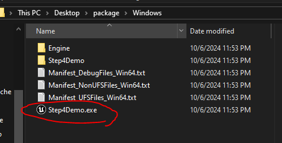
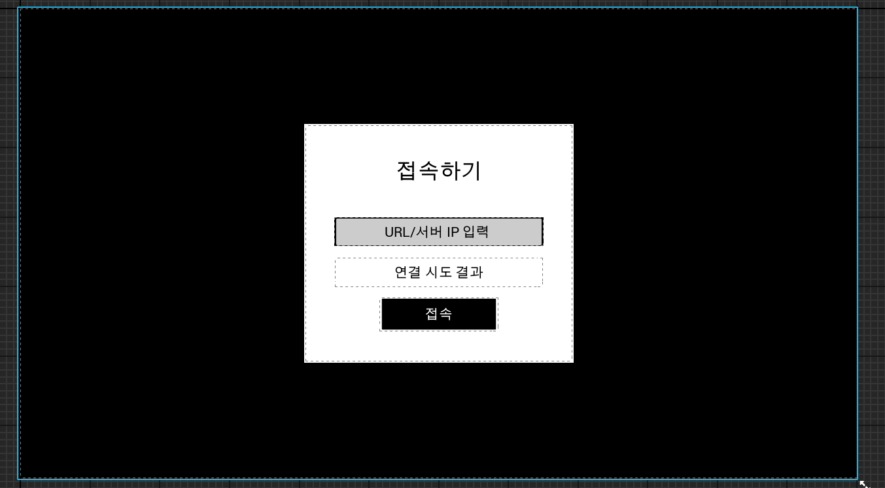
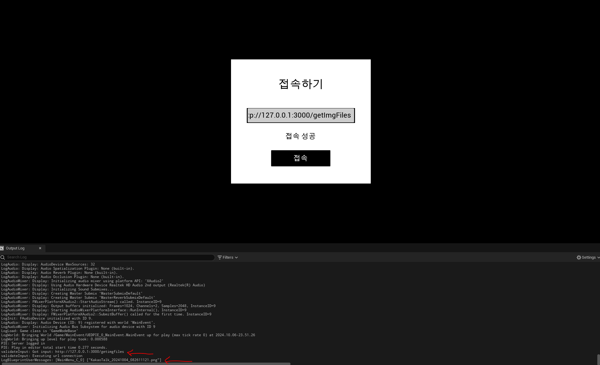
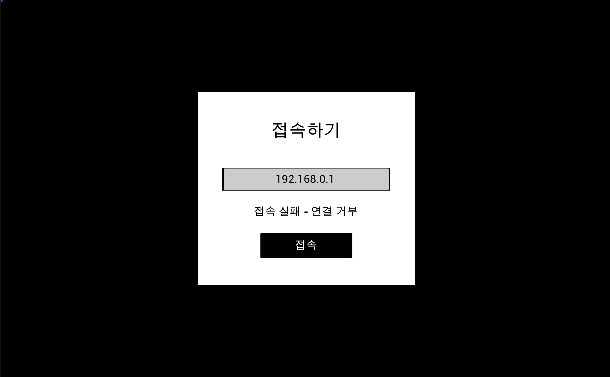
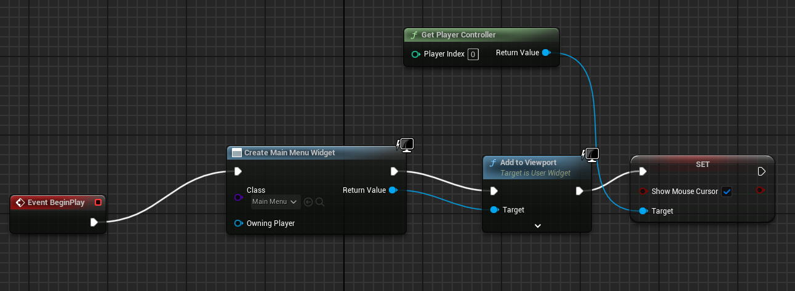
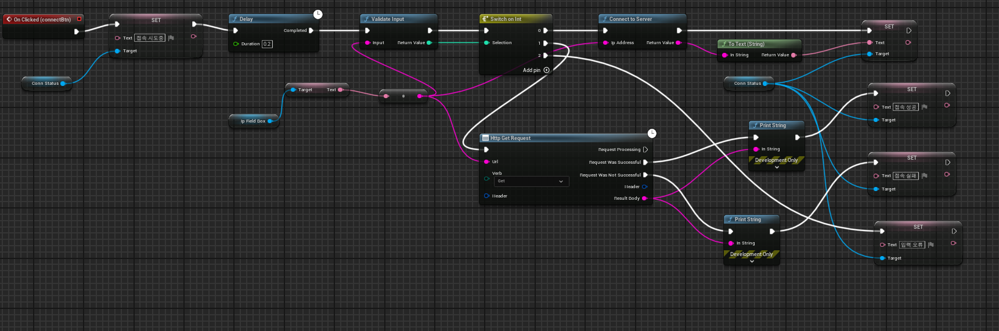

# Assignment-Step4
UMG 제작, HTTP API 연결, TCP Socket 연결

## 실행 법!

`/package/Windows.zip` ~~을 압축해제하고 나오는 exe 파일을 실행하면 됩니다.~~ (파일 사이즈가 커서 업로드가 안되는점 양해 부탁드립니다.)

--- 
### 알림 
> `InputValidateLibrary.cpp`을 추가해 입력을 받아 IP주소인지 URL 주소인지 판단하여 자동으로 request 매핑하는 기능을 추가했습니다.

> URL 이면 HTTP 연결을 시도하고 IP 기반이면 소캣 연결을 시도합니다. (물론 DNS 설정을 안한 서버는 IP 기반 URL을 사용하지만 버튼을 추가하기에는 요구사항에 없기 때문에 편리상 이렇게 만들었습니다.)

## 과제 순서

1. UMG 제작

UMG 파일 경로 `Step4Demo/Content/MainEvent/MainEvent.umap`

2. Blueprint Functions 제작

 

3. HTTP 기반 연결 제어

 C++ blueprint function을 추가 `HTTPConnection.cpp` `HTTPConnection.h`. Blocking(synchronous) 연결 대기. 이후에 5초 이내에 결과를 표시.

4. 소켓 기반 연결 제어
C++ blueprint function을 추가 `TCPSocketConnection.cpp` `TCPSocketConnection.h`. Blocking(synchronous) 연결 대기. 이후에 5초 이내에 결과를 표시.

> 아쉽게도 시간 관계상 수신된 Socket에 대해 반응하는 서버를 만들지 못했습니다. 그러나 수신은 정상적으로 되어 연결 실패와 사유가 뜨는 로직입니다.

## Blue print Flow

 메인 이벤트
 
 

인터페이스 플로우

## Source 경로
`Step4Demo/Source/Step4Demo`